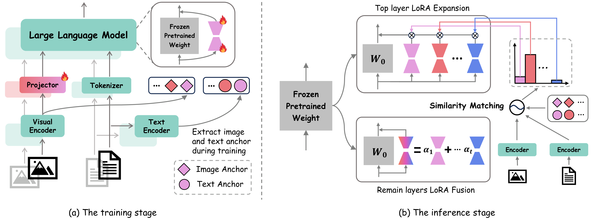

# HiDe-LLaVA: Hierarchical Decoupling for Continual Instruction Tuning of Multimodal Large Language Model (ACL 2025 Main)

[](https://huggingface.co/datasets/HaiyangGuo/UCIT)  [](https://arxiv.org/abs/2503.12941)

This repo is the official implementation of ACL 2025 paper: **[HiDe-LLaVA: Hierarchical Decoupling for Continual Instruction Tuning of Multimodal Large Language Model](https://arxiv.org/abs/2503.12941)**

> HiDe-LLaVA: Hierarchical Decoupling for Continual Instruction Tuning of Multimodal Large Language Model
>
> Haiyang Guo*, Fanhu Zeng*, Ziwei Xiang, Fei Zhu, Da-Han Wang, Xu-Yao Zhang, Cheng-Lin Liu



## News

- **2025.06**: Check out our new survey: "[A Comprehensive Survey on Continual Learning in Generative Models](https://arxiv.org/pdf/2506.13045)". We provide a systematic review of continual learning across mainstream generative models—including LLMs, MLLMs, Vision-Language Action Models, and Diffusion Models. Feel free to cite or open pull requests!

## Abstract

Instruction tuning is widely used to enhance a pre-trained Multimodal Large Language Model (MLLM) to understand and follow human instructions by training it on a curated set of task-specific dataset. However, it is infeasible to collect all possible instruction datasets simultaneously in real-world scenarios. Thus, enabling MLLM with continual instruction tuning is essential for maintaining their adaptability. However, existing methods often trade off memory efficiency for performance gains, significantly compromising overall efficiency. In this paper, we propose a task-specific expansion and task-general fusion framework based on the variations in Centered Kernel Alignment (CKA) similarity across different model layers when trained on diverse datasets. Furthermore, we analyze the information leakage present in the existing benchmark and propose a new and more challenging benchmark to rationally evaluate the performance of different methods. Comprehensive experiments showcase a significant performance improvement of our method compared to existing state-of-the-art methods.

## Installation

The installation of our environment is the same as [CoIN](https://github.com/zackschen/CoIN).

```bash
conda create -n hide python=3.10 -y
conda activate hide
pip install --upgrade pip
pip install -e .
pip install -e ".[train]"
pip install flash-attn --no-build-isolation
```

To measure the metrics of caption tasks, please install the following three packages:

```bash
pip install nltk==3.9.1
pip install pycocotools==2.0.8
pip install pycocoevalcap==1.2
```
We recommend replacing the eval.py file under that path `/envs/hide/lib/python3.10/site-packages/pycocoevalcap/` in your environment with the eval.py file that we have provided in the repository to avoid unwanted error reporting and time overhead.


Technical issues can be reported and addressed through the official GitHub issue trackers for both projects: [CoIN](https://github.com/zackschen/CoIN) and [LLaVA](https://github.com/haotian-liu/LLaVA).

## UCIT Benchmark

Please download the images from the constituting dataset：

|Image Source | Download Path|
| :-: | :-: |
|ArxivQA|[images](https://huggingface.co/datasets/MMInstruction/ArxivQA/tree/main)|
|ImageNet-R|[images](https://huggingface.co/datasets/HaiyangGuo/UCIT)|
|IconQA|[images](https://iconqa.github.io/)|
|CLEVR-Math|[images](https://huggingface.co/datasets/dali-does/clevr-math/tree/main)|
|VizWiz|[images](https://vizwiz.org/tasks-and-datasets/image-captioning/)|
|Flickr30k|[images](https://huggingface.co/datasets/HaiyangGuo/UCIT)|

After downloading all of them, organize the data as follows:
```
|-- datasets
    |-- ArxivQA
        |-- images/
    |-- CLEVR
        |-- images
            |-- train/
            |-- test/
            |-- val/
    |-- Flickr30k
        |-- train/
        |-- val/
    |-- IconQA
        |-- iconqa_data/
            |-- iconqa/
    |-- ImageNet-R
        |-- train/
        |-- test/
    |-- VizWiz
        |-- train/
        |-- test/
        |-- val/
```

Please download the instructions from our [HuggingFace](https://huggingface.co/datasets/HaiyangGuo/UCIT) page, then, organize the instructions as follows:
```
|-- instructions
    |-- ArxivQA
        |-- test_3000.json
        |-- train_4w.json
    |-- CLEVR
        |-- test_3000.json
        |-- train_4w.json
    |-- Flickr30k
        |-- test_3000.json
        |-- train_brief_4w.json
        |-- val_coco_type_3000.json
    |-- IconQA
        |-- test_3000.json
        |-- train.json
    |-- ImageNet-R
        |-- test_3000.json
        |-- train.json
    |-- VizWiz
        |-- test_3000.json
        |-- train.json
        |-- val_coco_type_3000.json
```

## Pre-trained Weights

Please download [LLaVA](https://huggingface.co/liuhaotian/llava-v1.5-7b) and [CLIP](https://huggingface.co/openai/clip-vit-large-patch14-336), and use the **config.json** provided in this repository replace the original config.json in LLaVA.

## Training and Evaluation

Once the data and instructions organized and placed correctly, you can train the model by running `./scripts/CoIN/Train_UCIT/train_all.sh`. After the training is completed, you can evaluate the performance by running `./scripts/CoIN/Eval_UCIT/Eval_all.sh`. **Be careful to modify the paths in all `.sh` files to your own actual paths.**

## Citation

```bibtex
@article{guo2025hide,
  title={Hide-llava: Hierarchical decoupling for continual instruction tuning of multimodal large language model},
  author={Guo, Haiyang and Zeng, Fanhu and Xiang, Ziwei and Zhu, Fei and Wang, Da-Han and Zhang, Xu-Yao and Liu, Cheng-Lin},
  journal={arXiv preprint arXiv:2503.12941},
  year={2025}
}
```

## Acknowledgememnt

This repository is built upon the [LLaVA](https://github.com/haotian-liu/LLaVA) and [CoIN](https://github.com/zackschen/CoIN) projects. We sincerely thank the authors for their valuable contributions to the research community.

